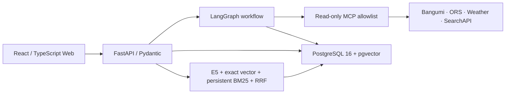

# Anime Pilgrimage Agent

A source-aware, mixed-initiative planner that turns anime pilgrimage ideas into a constraint-checked itinerary. Route A is the complete set of sourced candidate points; Route B is the executable subset selected by deterministic time, access, and walking rules. The product is read-only: it never books, pays, or silently confirms consequential choices.

## What is implemented

- Bangumi subject search with explicit confirmation and sourced Route A point import.
- Read-only provider/MCP boundaries for catalog, points, ORS, weather, and flight snapshots.
- Deterministic access/base selection, road-matrix planning, omissions, buffers, time zones, walking limits, and bounded Google Maps URLs.
- A durable LangGraph workflow with three explicit interrupts, PostgreSQL checkpoints, five project-owned memory stores, structured review, and a three-revision cap.
- Hybrid RAG for Markdown/TXT/text PDFs using multilingual E5, exact pgvector cosine search, persistent bm25s, RRF, namespace filters, citations, freshness, conflicts, and prompt-injection isolation.
- A responsive React workflow for request → subject confirmation → access/base → plan → local revision → evidence → JSON/GeoJSON/standalone HTML export.

## Architecture



Pydantic schemas guard every provider, tool, LLM, API, RAG, and export boundary. Deterministic code—not the model—owns distance/time/price arithmetic, time zones, membership, retry and revision limits, namespace filters, and validation. See [architecture](docs/02_ARCHITECTURE.md) and the accepted [ADRs](docs/adr/).

## Prerequisites

- Conda
- Docker Desktop with Compose
- Git

The dedicated environment is exactly `anime-pilgrimage-agent`. `environment.yml` owns Python 3.12, uv, and Make; `uv.lock` and `pnpm-lock.yaml` own application dependencies. Local values belong only in ignored `.env`; copy variable names from `.env.example` and never commit values.

## Bootstrap and fast development

```powershell
conda env create --solver rattler -f environment.yml
conda activate anime-pilgrimage-agent
make bootstrap
make verify-env
make dev-infra
make dev
```

Fast mode runs only PostgreSQL/pgvector in Docker. API, MCP, and Web run from the local locked toolchains. If the environment already exists, `make bootstrap-conda` updates only this dedicated environment from `environment.yml`.

## Full Compose

```powershell
conda activate anime-pilgrimage-agent
make compose-up
```

Web: `http://localhost:4173`; API: `http://localhost:8000`. MCP and PostgreSQL are isolated on the backend network (PostgreSQL also exposes a development port). Named volumes preserve PostgreSQL and the application-layer BM25 indexes. Stop only this project with `make compose-down`; do not prune unrelated Docker resources.

## Demo

The reproducible walkthrough is in [docs/DEMO.md](docs/DEMO.md). In brief:

1. Open the Web and submit the prefilled Kyoto → Tokyo, three-day request.
2. Explicitly confirm *Bocchi the Rock!* and inspect the three sourced Route A points.
3. Select the early/evening train candidates, Shimokitazawa base, and 5 km walking cap.
4. Generate Route B, inspect source/estimate labels, apply the Day 2-only 3 km revision, and verify Days 1 and 3 remain stable.
5. Inspect the dated/authority-labelled evidence and export JSON, GeoJSON, and standalone HTML.

All dates are relative to the test clock. The included content is fixed, short, project-authored fixture material; live provider checks are separate and read-only.

## Verification

```powershell
make lint
make typecheck
make test
make verify-phase-1
make verify-phase-2
make verify-phase-3
make verify-phase-4
make verify-phase-5
make verify-phase-6
make verify-all
```

Every phase writes `artifacts/phase-N-report.md` and fails non-zero on a failed check. `make verify-all` replays all six phase gates. Reports separate fixtures, browser E2E, real read-only smoke, and model smoke. Final evidence is summarized in `artifacts/final-verification.md`.

Current fixed-corpus RAG metrics are Recall@6 **0.929**, MRR@10 **0.952**, and Citation Precision **0.952**. Aggregate Python coverage is at least 80%; the validator/property suite covers Route B membership, required/excluded points, time windows, buffers, time zones, walking limits, and URL bounds.

## Security and privacy

- Secrets stay server-side and are scanned from source, reports, browser artifacts, and the production Web bundle without printing values.
- Project output is checked for the kickoff/conversation body, credential values, and forbidden MCP tools.
- MCP exposes exactly nine allowlisted read-only tools; there is no booking, payment, shell, filesystem, arbitrary URL, or database-query tool.
- External pages, uploads, MCP responses, and RAG text are untrusted data. Citations are limited to the current retrieval result.
- User and trip data are restricted to `curated + current user + current trip`; deletion removes database, dense, BM25, and citation visibility.

## Known limitations

- Fixture points are used because no stable, clearly authorized public Anitabi API was established; legal JSON/GeoJSON import is the supported boundary.
- Flights, routes, weather, prices, opening/access rules, and photography rules are snapshots or estimates and must be reconfirmed before departure.
- The MVP extracts text PDFs with pypdf but does not run OCR; scanned PDFs return `needs_ocr`.
- The Web demonstrates one validated scenario and local Day 2 revision rather than a general natural-language patch compiler.
- The real E5 snapshot must be downloaded once before offline verification; it is not committed to Git.
- This is a local portfolio implementation, not a deployed or multi-tenant production service.

See [the complete limitations](docs/KNOWN_LIMITATIONS.md), [data/safety policy](docs/06_DATA_SAFETY.md), and [resume/interview notes](docs/RESUME_BULLETS.md).
