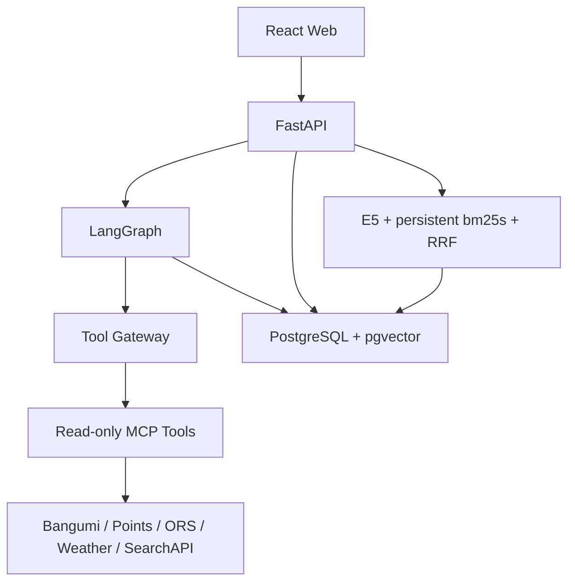

# 系统架构

## 固定技术栈

| 层 | 选择 |
|---|---|
| 前端 | React + TypeScript + Vite + TanStack Query |
| 地图 | MapLibre GL JS + OSM/OpenFreeMap |
| API | Python 3.12 + FastAPI + Pydantic v2 |
| Agent | LangGraph 显式状态机 |
| MCP | Python MCP SDK/FastMCP + langchain-mcp-adapters |
| 数据 | PostgreSQL 16 + pgvector + SQLAlchemy 2 + Alembic |
| RAG | 本地多语言 sentence-transformers + 向量/关键词混合检索 + RRF |
| 测试 | pytest/respx/Hypothesis + Vitest/Testing Library/Playwright |
| 工具链 | Conda（Python 环境）+ uv（依赖锁定）+ pnpm + Docker Compose + 根 Makefile |

不要为 MVP 添加 Redis、Kafka、Elasticsearch、Kubernetes。

## Conda 与 Docker 分工

- Conda 环境固定为 `anime-pilgrimage-agent`，提供 Python 3.12、pip 和 uv；
- uv 管理 Python 依赖与 lockfile，不在 `environment.yml` 重复维护应用包；
- 快速开发：Conda 运行 API/MCP，pnpm 运行 Web，Docker 只运行 PostgreSQL + pgvector；
- 完整验收：Compose 构建运行 web、api、mcp-tools、postgres；
- Makefile 同时支持已激活 Conda 环境和 `conda run -n anime-pilgrimage-agent`；
- Dockerfile 使用固定基础版本、多阶段构建、非 root 用户、健康检查；
- 密钥只能运行时注入，不能写入镜像层；
- Compose 使用命名 volume 保存数据库，内部网络隔离 MCP/Postgres，不执行全局 prune。

## 拓扑



Docker Compose 包含 `web`、`api`、`mcp-tools`、`postgres`。MCP 服务仅在内部网络开放；前端不能直接持有外部 API Key。PostgreSQL 与 BM25 分别使用项目命名 volume，API 镜像以非 root 用户写入显式授权的索引目录。

## 推荐目录

```text
apps/web
apps/api
services/mcp_tools
packages/domain
packages/providers
tests/unit
tests/contract
tests/integration
tests/e2e
fixtures
docs/adr
artifacts/screenshots
```

## LangGraph 节点

```text
Requirement
→ ConfirmRequirements
→ ResolveSubject
→ ConfirmSubject
→ FetchPoints
→ BuildRouteA
→ AccessPlanner
→ ConfirmAccessAndBase
→ RetrieveKnowledge
→ PilgrimagePlanner
→ DeterministicValidator
→ Reviewer
→ Replan (max 3)
→ Present/Export
```

人类确认使用 interrupt/resume。Reviewer 只输出结构化 violation 和 patch request；程序控制最大循环次数。

## 核心领域对象

```text
TripRequest, ConfirmedSubject, PilgrimagePoint,
FlightOption, IntercityOption, AccessPlan, BasePlan,
RouteA, RouteB, DayPlan, Visit, RouteLeg,
ConstraintSet, PlanViolation, PlanPatch, PlanRevision,
Citation, DataProvenance, ToolCallRecord
```

`TripState` 是唯一事实来源。大对象存数据库，Graph State 传 ID、摘要和必要字段。Route B 成员必须属于 Route A。

## 程序与 LLM 分工

LLM：语言理解、歧义说明、优先级解释、计划叙述、RAG 综合、按 Reviewer 请求修订。

普通程序：Schema、距离、路线矩阵、时区、时间冲突、价格算术、聚类、成员检查、必去覆盖、URL、数据有效期、循环终止。

## Provider 接口

```text
AnimeCatalogProvider
PilgrimagePointProvider
FlightSearchProvider
IntercityTransitProvider
GeocodingProvider
RoutingProvider
WeatherProvider
KnowledgeRetriever
```

每个 Provider 都必须有真实实现、Fixture/Mock、统一错误、超时、有限重试、缓存、Provenance 和契约测试。

RAG 不能替代 Provider 的结构化实时数据。摄取、测试资料搜索、索引、检索、引用、权限和评估以 `docs/09_RAG_SPEC.md` 为唯一实现规格。

实现后的边界决策记录在 `docs/adr/0001-provider-and-data-boundaries.md` 与 `docs/adr/0002-agent-memory-and-rag.md`。
